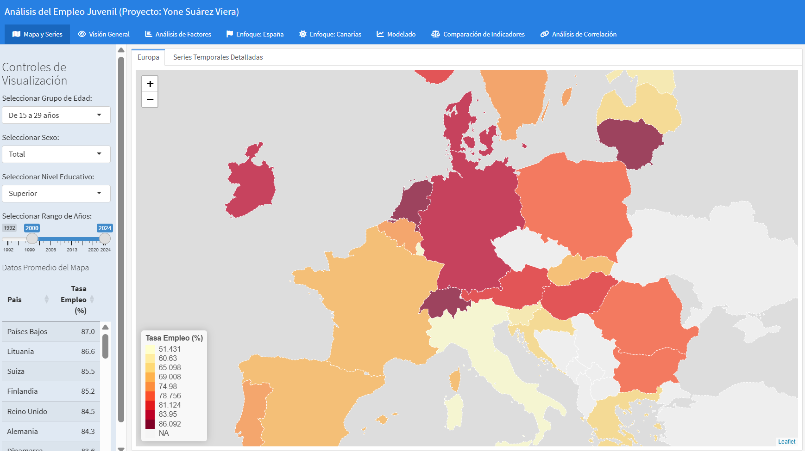

# Análisis del Empleo Juvenil en Europa 🇪🇺
**Proyecto Universitario - Calificación: 9/10**



Este repositorio contiene un análisis exhaustivo sobre el empleo juvenil en Europa, desglosado por sexo, edad y nivel educativo. El proyecto combina técnicas de **Ciencia de Datos**, **Análisis Estadístico** y **Visualización Interactiva** utilizando el lenguaje de programación **R**.

## 📊 Descripción del Proyecto
El objetivo principal es identificar y visualizar las brechas de empleabilidad en la población joven europea utilizando datos oficiales de **Eurostat** (dataset `yth_empl_010`). 

A través de este análisis se exploran:
*   La influencia del nivel educativo en la inserción laboral.
*   Desigualdades de género en el acceso al empleo.
*   Diferencias estructurales entre los distintos países de la UE.

## 🚀 Características Principales
*   **Dashboard Interactivo**: Panel de control desarrollado con `flexdashboard` y `Shiny` que permite filtrar datos por país, año y variables demográficas.
*   **Análisis Geoespacial**: Mapas coropléticos interactivos mediante `leaflet` para comparar indicadores entre regiones.
*   **Modelado Predictivo**: Implementación de modelos **ARIMA** (librería `fpp3`) para predecir tendencias futuras en el empleo juvenil.
*   **Visualización Avanzada**: Gráficos dinámicos realizados con `Plotly` y `Highcharter`.
*   **Limpieza de Datos**: Pipeline robusto de preprocesamiento utilizando `Tidyverse`.

## 🛠️ Tecnologías Utilizadas
El proyecto está desarrollado íntegramente en **R** v4.x, apoyándose en las siguientes librerías:
*   `Tidyverse` (dplyr, ggplot2, tidyr) para manipulación de datos.
*   `Shiny` & `flexdashboard` para la interfaz de usuario.
*   `Leaflet` para mapas interactivos.
*   `Plotly` & `Highcharter` para gráficos dinámicos.
*   `fpp3` & `forecast` para análisis de series temporales.
*   `pxR` para la lectura de datos en formato PC-Axis.

## 📂 Estructura del Repositorio
*   `Dashboard.Rmd`: Código fuente del cuadro de mandos interactivo.
*   `ModeloMemoriaProyectoPersonalAEDV.Rmd`: Memoria detallada con la metodología y conclusiones del análisis.
*   `utilidades.R`: Funciones auxiliares para visualización y transformaciones estadísticas (como Yeo-Johnson).
*   `yth_empl_010.csv`: Dataset principal extraído de Eurostat.

## ⚙️ Cómo Ejecutar el Proyecto
1.  Asegúrate de tener instalado [R](https://www.r-project.org/) y [RStudio](https://rstudio.com/).
2.  Clona este repositorio:
    ```bash
    git clone https://github.com/tu-usuario/nombre-del-repo.git
    ```
3.  Abre el archivo `Dashboard.Rmd` en RStudio.
4.  Instala las dependencias necesarias ejecutando:
    ```r
    install.packages(c("tidyverse", "flexdashboard", "shiny", "plotly", "leaflet", "fpp3", "pxR", "highcharter", "DT"))
    ```
5.  Pulsa en **"Run Document"** para visualizar el dashboard interactivo.

## 🎓 Autor
**Yone Suárez Viera**  
Estudiante de Ciencia e Ingeniería de Datos - ULPGC

---
*Este trabajo fue realizado para la asignatura de Análisis y Explotación de Datos (AEDV), obteniendo una calificación de 9.0.*